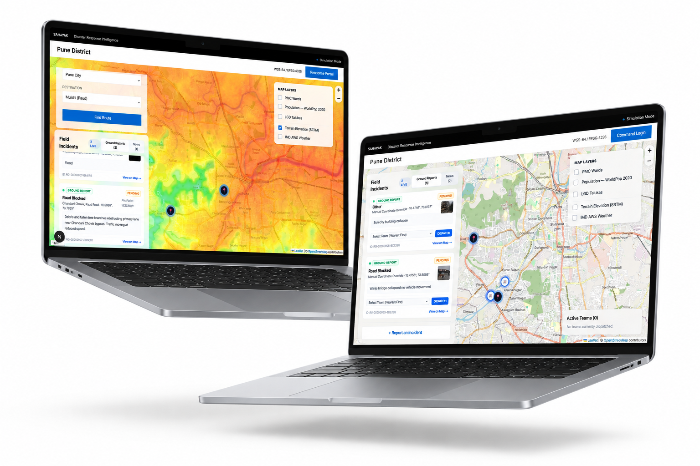
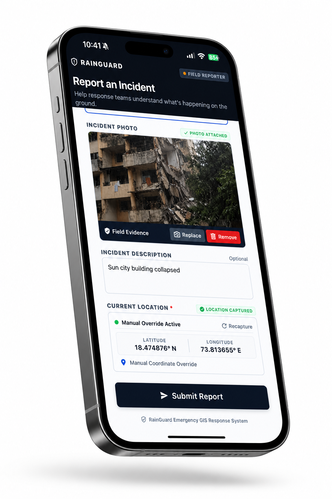

# SAHAYAK: Hazard-to-Settlement-to-Road Intelligence Platform

## Overview
SAHAYAK is a state-of-the-art, multi-layered geospatial intelligence platform engineered to bridge the critical gap between early disaster warnings and actionable on-ground response. Unlike conventional systems that merely predict *where* a hazard might occur, SAHAYAK calculates the cascading impact on critical infrastructure and human populations. By integrating high-frequency environmental telemetry, deep topographical modeling, and localized ground-truth streams, the platform precisely determines which road networks remain navigable, which settlements are structurally isolated, and how to optimally route emergency responders.

## The Intelligence Architecture: Deep Geospatial Layers
Our platform achieves unprecedented accuracy by compositing multiple highly calibrated data layers and employing advanced inference engines:

### 1. Topographical & Elevation Analytics Layer
* **NASA SRTM (Shuttle Radar Topography Mission) Methodology:** We process 30-meter resolution `.hgt` DEM (Digital Elevation Model) tiles to compute highly granular terrain slopes, drainage basins, and hydrological flow accumulation models. This forms the foundational bedrock for flash flood susceptibility modeling.
* **Geological Hazard Zones:** Real-time ingestion of landslide susceptibility polygons using data derived from the ISRO Bhuvan Landslide Atlas and the Geological Survey of India (GSI).

### 2. Hyper-Local Meteorological Layer
* **IMD (Indian Meteorological Department) AWS Telemetry:** Real-time integration of Automatic Weather Station (AWS) data for highly localized precipitation ground-truth.
* **Multispectral Satellite & Radar Feeds:** Processing dense, high-frequency satellite rainfall observation data (NASA GPM IMERG) alongside micro-location grids from OpenWeatherMap, AccuWeather, and RainViewer APIs.
* **Precipitation Probability Heatmaps:** Live rendering of Open-Meteo nowcast models to visualize moving weather fronts with minute-level precision.

### 3. Demographic & Administrative Layer
* **High-Resolution Population Density Grids:** Utilizing Meta (CIESIN) 30m High-Resolution Population Maps and WorldPop gridded datasets to quantify the exact number of individuals exposed in a hazard zone.
* **LGD (Local Government Directory) & Taluka Boundaries:** Precise administrative clipping using Census India and Bhuvan village/Taluka boundaries to ensure impact reports align perfectly with bureaucratic response jurisdictions.

### 4. Dynamic Road Graph & Accessibility Inference Layer
* **OSRM Custom Profile Routing:** Operating a self-hosted Open Source Routing Machine (OSRM) instance over OpenStreetMap (OSM) data for Maharashtra. 
* **Algorithmic Closure Penalties:** A road segment is algorithmically penalized (marked "at-risk") if it intersects a hazardous grid cell, crosses historical low-water causeways, or triggers a threshold of corroborating ground reports. OSRM recalculates safe routes dynamically, avoiding silent failures.

### 5. Multi-Channel Ground Truth & News Scraping Layer
* **Dedicated Citizen Reporting Mobile App:** A specialized React Native mobile application deployed for on-the-ground intelligence gathering. Citizens can report blockages, water levels, and incidents with geolocated photographic evidence.
* **Autonomous Web Scraping & Live News Agents:** Dedicated autonomous AI agents that continuously scrape, parse, and geolocate live regional news reports and social media feeds, feeding unstructured disaster updates directly into our intelligence pipeline as secondary validation nodes.
* **WhatsApp & SMS Intake:** Low-connectivity integration via Twilio and WhatsApp Business Cloud API.

### 6. Evidence-Weighted Confidence Engine
Every generated alert carries a transparent, deterministic **Confidence Score**. The engine scales probability by corroborating diverse sensor inputs (e.g., IMD AWS + SRTM elevation + 2 mobile app reports + scraped local news) while algorithmically down-weighting conflicting telemetries.

### 7. AI-Powered Triage & Historical Replay Harness
* **Google Gemini AI Explanation:** Gemini API interprets the complex multidimensional data to output actionable, human-readable triage summaries and "why" narratives.
* **Simulated Disruption Harness:** The system supports a "Replay Mode" for historical event backtesting (e.g., 2019/2021 Pune floods), rigorously measuring our False Positive Rate and Route Validity under simulated network degradation.

## Screenshots


*Caption: The main intelligence dashboard highlighting the live priority queue, LGD Taluka overlays, IMD AWS weather integration, and the explicitly surfaced evidence confidence cards.*


*Caption: The dedicated citizen-facing mobile application capturing geolocated disaster evidence, seamlessly syncing with the central intelligence node.*

## Resilient Infrastructure & API Fallbacks
Engineered with zero single points of failure. Every critical system has an automated fallback protocol:
* **Current Weather:** AccuWeather API -> Open-Meteo.
* **Radar & Nowcast:** RainViewer API -> Open-Meteo probability layer.
* **Flood Forecasting:** Google Flood Hub API -> Custom hydrology proxy (SRTM + Cumulative rain).
* **Population:** Meta High-Resolution Density -> WorldPop 100m.
* **Road Network:** Geofabrik OSM -> Bhuvan WMS.

## Technology Stack
* **Core Analytics & Backend:** Python 3, Flask, NumPy, Rasterio, GeoPandas, SQLite
* **Frontend Dashboard:** Next.js, React, Tailwind CSS, Leaflet.js
* **Mobile Field App:** React Native, Expo
* **Algorithmic Routing:** Self-hosted OSRM via Docker
* **AI & Web Scraping:** Google Gemini API, Custom News Scraping Agents

## Getting Started

### Prerequisites
* Python 3.10+
* Node.js 18+ and npm
* Expo Go app installed on your physical mobile device
* Docker (for self-hosting the OSRM instance)

### 1. Backend Setup (Flask API)
1. Navigate to the root directory.
2. Create and activate a virtual environment:
   ```bash
   python -m venv venv
   source venv/bin/activate  # On Windows use: .\venv\Scripts\activate
   ```
3. Install dependencies:
   ```bash
   pip install -r backend/requirements.txt
   ```
4. Configure environment variables by renaming `env` to `.env` and adding your API keys (the system will use free fallbacks automatically if keys are omitted).
5. Start the server:
   ```bash
   python -m backend.app
   ```
   The backend will run on `http://localhost:5000`.

### 2. Frontend Setup (Next.js Web App)
1. Open a new terminal and navigate to the `frontend` directory:
   ```bash
   cd frontend
   ```
2. Install dependencies:
   ```bash
   npm install
   ```
3. Start the development server:
   ```bash
   npm run dev
   ```
   Access the dashboard at `http://localhost:3000`.

### 3. Mobile Setup (Expo App)
1. Open a third terminal and navigate to the `mobile` directory:
   ```bash
   cd mobile
   ```
2. Install dependencies:
   ```bash
   npm install
   ```
3. Start the Expo bundler:
   ```bash
   npm run start
   ```
4. Scan the generated QR code using the Expo Go app on your mobile device to test the application locally. Ensure your mobile device and computer are on the same local network.

## License
This project is proprietary and developed for deployment testing.
