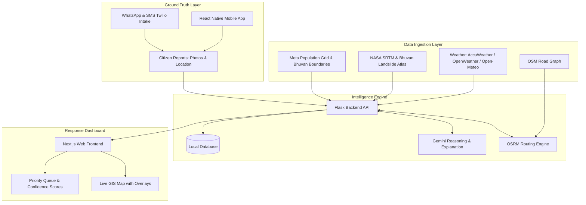

# SAHAYAK: Hazard-to-Settlement-to-Road Intelligence Platform

## Overview
Communities frequently receive flood or landslide warnings without knowing which roads are still usable or where help is needed first. SAHAYAK is a comprehensive intelligence platform that bridges this gap. It connects hazard warnings with affected settlements and road accessibility, utilizing environmental observations and real-time reports from people on the ground. This allows response teams to explain each alert transparently and prioritize their actions effectively.

## Problem Statement
A generic warning without knowing which roads still work is not actionable. Existing systems answer "will it flood here", but fail to answer:
* Which roads are still usable?
* Which settlements need help first?
* How confident are we in this warning, and what is the underlying evidence?

## Intelligence Layer & Core Algorithms

Our platform relies on four highly calibrated mathematical layers to determine response priority:

### 1. Hazard Scoring Engine
We calculate hazard severity per grid cell (village level) by combining weather telemetry with topography:
`hazard_score = w1(rainfall_intensity) + w2(cumulative_72h_rainfall) + w3(terrain_susceptibility) + w4(distance_to_known_flood_zone_inverse)`
* **Terrain Susceptibility** is calculated using SRTM-derived slope, flow accumulation (for floods), and Bhuvan landslide classification (for the Western Ghats).

### 2. Settlement Impact Scorer
A high-hazard, low-population hamlet ranks below a moderate-hazard, high-population village to ensure limited resources are triaged logically.
`settlement_impact = hazard_score(village) * population(village)`
* Population counts are actively mapped using Meta High-Resolution Population Density Maps and Bhuvan administrative boundaries.

### 3. Road-Closure Inference & Dynamic Routing
Powered by a self-hosted OSRM instance over OpenStreetMap data for Maharashtra. A road segment is marked "at-risk" if:
1. It intersects a grid cell above the hazard threshold, OR
2. It crosses a known low-water crossing / historical flood zone, OR
3. It has ≥2 independent crowd reports flagging it within the last N hours.
At-risk segments receive routing-weight penalties. OSRM naturally reroutes around them, returning usable alternate paths rather than failing silently.

### 4. Intelligent Priority Queue
Responders see a dynamically ranked queue where final priority dictates action:
`priority = settlement_impact * road_isolation_factor`
* `road_isolation_factor` spikes when a settlement's *only* access routes are flagged as at-risk (i.e., genuinely cut off), not just when one of several roads is affected.

### 5. Confidence & Evidence Engine
Every alert carries a confidence score built transparently from its inputs. The system weighs base data source quality, adds weight for corroborating ground truth, and subtracts weight if inputs conflict (e.g., rain sensors conflict with ground reports). The UI explicitly surfaces the exact evidence stack (e.g., "72mm rain in 3h + SRTM low-lying zone + 2 ground reports").

### 6. AI-Powered Triaging & Replay Harness
Google Gemini API is utilized for report triage, alert explanation text, and generating the "why" narrative. The platform includes a built-in historical-event replay harness with labeled ground truth (e.g., 2019/2021 Pune floods). This provides hard, tested numbers on our **False Positive Rate** and **Route Validity Success Rate** under simulated disruptions.

## System Architecture



## Screenshots


*Caption: The main intelligence dashboard showing live incidents, the priority queue, hazard overlays, and explicitly surfaced evidence cards.*


*Caption: The citizen-facing mobile application used for capturing ground truth data, working in tandem with the WhatsApp intake bot.*

## Resilient Data Infrastructure
Our core engineering principle: **nothing has a single point of failure**. Every primary source has a documented, genuinely free fallback:
* **Current Weather:** AccuWeather API -> Open-Meteo.
* **Micro-location Rainfall:** OpenWeatherMap -> Open-Meteo hourly grid.
* **Radar Visualization:** RainViewer API -> Open-Meteo precipitation probability layer.
* **Riverine Flood Forecast:** Google Flood Hub API -> Custom hydrology proxy (cumulative rain + SRTM flow-accumulation).
* **Landslide Susceptibility:** ISRO Bhuvan Landslide Atlas -> Static GSI/NRSC shapefiles.
* **Road Graph:** OSM via Geofabrik -> Bhuvan WMS road layer.
* **Population Base:** Meta High-Resolution Density Maps -> WorldPop 100m grid.
* **Routing:** Self-hosted OSRM -> Public OSRM demo server fallback.

## Technology Stack
* **Backend:** Python 3, Flask, SQLite, NumPy, Rasterio, GeoPandas
* **Frontend:** Next.js, React, Tailwind CSS, Leaflet.js
* **Mobile:** React Native, Expo
* **Routing:** Self-hosted OSRM (Docker)
* **AI & NLP:** Google Gemini API

## Getting Started

### Prerequisites
* Python 3.10+
* Node.js 18+ and npm
* Expo Go app installed on your physical mobile device
* Docker (for self-hosting the OSRM instance)

### 1. Backend Setup (Flask API)
1. Navigate to the root directory.
2. Create and activate a virtual environment:
   ```bash
   python -m venv venv
   source venv/bin/activate  # On Windows use: .\venv\Scripts\activate
   ```
3. Install dependencies:
   ```bash
   pip install -r backend/requirements.txt
   ```
4. Configure environment variables by renaming `env` to `.env` and adding your API keys (the system will use free fallbacks automatically if keys are omitted).
5. Start the server:
   ```bash
   python -m backend.app
   ```
   The backend will run on `http://localhost:5000`.

### 2. Frontend Setup (Next.js Web App)
1. Open a new terminal and navigate to the `frontend` directory:
   ```bash
   cd frontend
   ```
2. Install dependencies:
   ```bash
   npm install
   ```
3. Start the development server:
   ```bash
   npm run dev
   ```
   Access the dashboard at `http://localhost:3000`.

### 3. Mobile Setup (Expo App)
1. Open a third terminal and navigate to the `mobile` directory:
   ```bash
   cd mobile
   ```
2. Install dependencies:
   ```bash
   npm install
   ```
3. Start the Expo bundler:
   ```bash
   npm run start
   ```
4. Scan the generated QR code using the Expo Go app on your mobile device to test the application locally. Ensure your mobile device and computer are on the same local network.

## License
This project is proprietary and developed for deployment testing.
